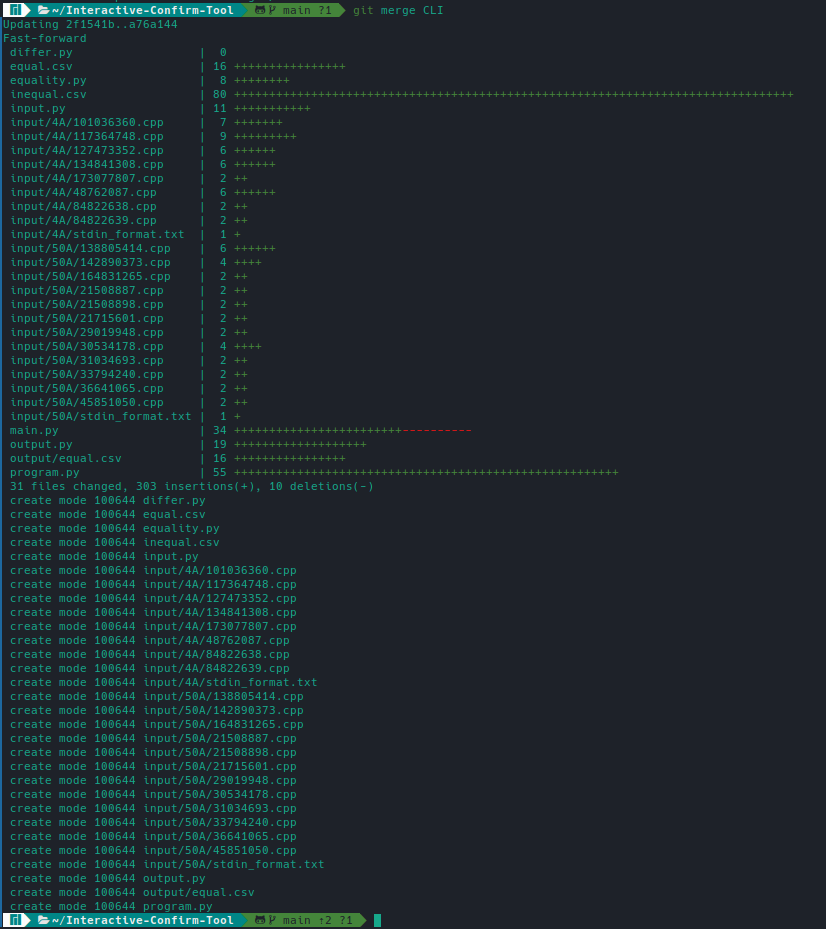

### Interactive-Confirm-Tool

<<<<<<< HEAD
#### 201840058 蒋潇鹏

#### 一、项目概述

本次实验目的是完成一个交互式等价确认工具，输入为等价判断程序得出的结果，能为用户提供交互方式，对程序等价性进行。输出为一个csv文件，输出经过验证后的等价程序对。

实验使用的语言为Python，GUI框架为PyQt5。使用的UI设计工具为QtDesigner

#### 二、Git使用

1. 我在本地尝试了修改操作：
   修改前的代码：完成实验后我发现有些import的库并没有被使用，于是删除：
   
   这是删除后的代码：
   
   在Terminal运行 `git diff`:
   

2. 尝试将刚才的修改提交：
   首先运行 `git status` 查看当前状态：
   
   可以从图中看见所有modified的文件，这些文件是已经被commit了的文件，但被修改了。还有Untracked files，是还没有被添加进git的文件。
   接下来我们运行 `git add main.py`，来把刚才对 `main.py` 文件的修改 commit 到 git 中。
   然后再次运行 `git status` 查看状态：
   
   可以看到之前的 `main.py` 已经从工作区被添加到暂存区了。
   接下来我们运行 `git commit`：进入 vim 界面，输入message并保存：
   

   保存后我们运行 `git log`：
   
   就可以看到上次的提交情况了。

3. 对于回退版本，我们有两种选择：`reset` 和 `revert`：
   reset和revert的区别在于，reset是回退到git的某次commit, 在此commit之后的均被舍弃。
   执行命令`git reset` 如下：
   
   再次查看 `git log`，可以发现此前的提交不见了：
   
   此时运行 `git reflog` 来查看所有的git操作：
   
   此时使用 `git reset cc6a` 即可恢复回`reset`前的状态。

   同样地，我们也可以使用 `git revert 6ea0`：
   
   可以看到出现了错误，那是因为我们还有一些冲突没有解决，解决之后再次执行，可以发现`git log`变成了这样：
   
   由此可以发现，`git reset` 不保留reset后的commit，直接将HEAD置于目标位置，`git revert`则本质上相当于创建一个新的`commit`来恢复到之前的修改状态。

4. 接下来我们来尝试 `merge` 与 `rebase` 。
   首先我们把 `CLI` （命令行版本）merge到main分支里：
   
   再查看`log`
   
   可以看到CLI的内容被merge进了main，与之相对的是remote中的main(origin/main)

   接下来我们尝试 `git rebase` 将GUI分支rebase到main：
   
   查看log:
   

   不过这里两个分支的merge都是直线形，并不太能体现其区别。如果有多个同时开发的分支，`git merge`会在图上显示出合并的路径，如实验4中：
   
   而 `git rebase` 就不会这样，它的行为如下图：
   
   

5. `git stash`的使用：
   首先我删除了程序中的一行代码，使用`git stash`
   
   这时候被删除的代码消失了。
   此时我在原先代码上增加一行代码，然后运行 `git stash pop`，提示合并冲突，因为 `git stash pop` 能够恢复之前 `stash` 暂存的内容

6. `git cherry-pick`的使用：将指定的提交应用于其他分支。

#### 三、关键代码介绍

1. 首先设计输入模块，我们考虑输入模块的需求：读取一个csv文件的路径，因此我们只需要提供一个静态的方法，将读入作为一个列表返回。
   ```python
   class Input:
   
       @staticmethod
       def read(csv_path):
           with open(csv_path, 'r', encoding='utf-8') as f:
               reader = csv.reader(f)
               headers = next(reader)
               return [row for row in reader]
   
   ```

2. 然后是设计输出模块，输出模块的需求是写入一个csv文件，内容是verified_pairs。Output类需要先辈verified_pairs 和 output_dir 初始化，随后执行write_csv。

   ```python
   class Output:
   
       def __init__(self, verified_pairs, output_dir):
           self.__output_dir__ = os.path.join(output_dir, "output")
           self.__verified_pairs__ = [pair.get_list() for pair in verified_pairs]
   
       def write_csv(self):
           if not os.path.exists(self.__output_dir__):
               os.mkdir(self.__output_dir__)
           eq_csv_path = os.path.join(self.__output_dir__, "equal.csv")
           header = ['file1', 'file2']
           with open(eq_csv_path, "w", encoding='utf-8', newline='') as eq_csv:
               writer = csv.writer(eq_csv)
               writer.writerow(header)
               writer.writerows(self.__verified_pairs__)
   
   ```

3. 接下来设计数据表示模块，这里，数据由一个ProgPair类来表示，元素分别是两个程序路径和等价性。
   diff() 调用 difflib来生成 diff比对结果的HTML数据。

   ```python
   class Equality(Enum):
       EQUAL_M = 1
       NOT_EQUAL = 2
       HUMAN_VERIFIED = 3
       DOUBT = 4
   
   class Progpair:
       def __init__(self, prog1, prog2, eq):
           self.prog1 = prog1
           self.prog2 = prog2
           self.eq = eq
   
       def diff(self):
           with open(self.prog1, 'r', encoding='utf-8') as f1:
               contents1 = f1.read().splitlines(keepends=True)
           with open(self.prog2, 'r', encoding='utf-8') as f2:
               contents2 = f2.read().splitlines(keepends=True)
           d = difflib.HtmlDiff()
           return d.make_file(contents1, contents2)
   
       def get_eq(self):
           return self.eq
   
       def set_eq(self, eq):
           self.eq = eq
   
       def get_list(self):
           return [self.prog1, self.prog2]
   ```

4.  最后是程序的主逻辑：ConfirmTool类继承了Qt的QMainWindow和ui.Ui_MainWIndow，后者是我在UI中自己设计的窗口。
   下面介绍它的接口：

   1. `load()`从当前路径装载 `input/equal.csv` 和 `input/nequal.csv`

   2. `export()` 将等价程序对输出到 `output/equal.csv`

   3. `display()` 用来更新 Qt 的各个组件状态来渲染

   4. `press()` 是按下UI按钮的响应函数，根据按下按钮的类型来将self.current_pair设置为对应类型。

   5. `get_next()` 是自动获取下一个待比较pair。我维护了一个 worklist 来维护待比较的pairs，get_next() 会从worklist中取出第一个元素（如果worklist）非空。

   6. `item_click_***()` 是按下列表中按钮的不同响应函数，我实现了按下左边菜单栏中的元素，能够将当前比较对重置为选中程序对的功能。


   ```python
   class ConfirmTool(QMainWindow, ui.Ui_MainWindow):
   
       def __init__(self, parent=None):
           super(ConfirmTool, self).__init__(parent)
           self.setupUi(self)
           self.eq_list = []
           self.neq_list = []
           self.worklist: deque = None
           self.eq_pairs = []
           self.neq_pairs = []
           self.human_verified_pairs = []
           self.doubt_pairs = []
           self.current_pair: Progpair = None
           self.load_path = os.path.join(os.getcwd())
           self.export_path = os.path.join(os.getcwd())
           self.eq_button.clicked.connect(lambda: self.press(Equality.HUMAN_VERIFIED))
           self.neq_button.clicked.connect(lambda: self.press(Equality.NOT_EQUAL))
           self.notsure_button.clicked.connect(lambda: self.press(Equality.DOUBT))
           self.actionImport_from.triggered.connect(lambda: self.load(self.load_path))
           self.actionExport_to.triggered.connect(lambda: self.export(self.export_path))
           self.waiting_listview.itemClicked.connect(self.item_click_judged)
           self.nequal_listview.itemClicked.connect(self.item_click_neq)
           self.equal_listview.itemClicked.connect(self.item_click_verified)
           self.nsure_listview.itemClicked.connect(self.item_click_doubt)
           self.item_map = {}
   
       def item_click_judged(self):
           item = self.waiting_listview.selectedItems()[0]
           clicked_pair = self.item_map[item.text()]
           if self.current_pair is not None and self.current_pair is not clicked_pair:
               self.worklist.appendleft(self.current_pair)
               self.current_pair = clicked_pair
           self.display()
   
       def item_click_neq(self):
           item = self.nequal_listview.selectedItems()[0]
           clicked_pair = self.item_map[item.text()]
           if self.current_pair is not None and self.current_pair is not clicked_pair:
               self.worklist.appendleft(self.current_pair)
           self.current_pair = clicked_pair
           self.display()
   
       def item_click_verified(self):
           item = self.equal_listview.selectedItems()[0]
           clicked_pair = self.item_map[item.text()]
           if self.current_pair is not None and self.current_pair is not clicked_pair:
               self.worklist.appendleft(self.current_pair)
               self.current_pair = clicked_pair
           self.display()
   
       def item_click_doubt(self):
           item = self.nsure_listview.selectedItems()[0]
           clicked_pair = self.item_map[item.text()]
           if self.current_pair is not None and self.current_pair is not clicked_pair:
               self.worklist.appendleft(self.current_pair)
               self.current_pair = clicked_pair
           self.display()
   
       def get_next(self):
           if len(self.worklist) > 0:
               self.current_pair = self.worklist.popleft()
               self.display()
           widget2list = [
               [self.equal_listview, self.human_verified_pairs],
               [self.nequal_listview, self.neq_pairs],
               [self.waiting_listview, self.eq_pairs],
               [self.nsure_listview, self.doubt_pairs]
           ]
           self.item_map = {}
           for widget, pair_list in widget2list:
               widget.clear()
               for pair in pair_list:
                   item_str = pair.prog1 + "," + pair.prog2
                   item = QListWidgetItem(pair.prog1 + "," + pair.prog2)
                   self.item_map[item_str] = pair
                   widget.addItem(item)
   
       def press(self, equality: Equality):
           if self.current_pair is not None:
               self.current_pair.eq = equality
               for pairlist in [self.eq_pairs, self.neq_pairs, self.human_verified_pairs, self.doubt_pairs]:
                   if self.current_pair in pairlist:
                       pairlist.remove(self.current_pair)
   
               if equality == Equality.HUMAN_VERIFIED:
                   self.human_verified_pairs.append(self.current_pair)
               elif equality == Equality.NOT_EQUAL:
                   self.neq_pairs.append(self.current_pair)
               elif equality == Equality.DOUBT:
                   self.doubt_pairs.append(self.current_pair)
               self.get_next()
   
       def display(self):
           if self.current_pair is not None:
               diff = self.current_pair.diff()
               self.prog1_text.setText(self.current_pair.prog1)
               self.prog2_text.setText(self.current_pair.prog2)
               self.diff_render.setHtml(diff)
               if self.current_pair.eq == Equality.EQUAL_M:
                   self.pair_category.setText("Machine Judged Equal")
               elif self.current_pair.eq == Equality.NOT_EQUAL:
                   self.pair_category.setText("Not Equal")
               elif self.current_pair.eq == Equality.HUMAN_VERIFIED:
                   self.pair_category.setText("Human Verified Equal")
               elif self.current_pair.eq == Equality.DOUBT:
                   self.pair_category.setText("Doubt")
   
   
       def load(self, fname):
           eq_name = os.path.join(fname, 'input/equal.csv')
           neq_name = os.path.join(fname, 'input/inequal.csv')
           self.eq_list = Input.read(eq_name)
           self.neq_list = Input.read(neq_name)
           self.item_map = {}
           self.eq_pairs = [Progpair(pair[0], pair[1], Equality.EQUAL_M) for pair in self.eq_list]
           self.neq_pairs = [Progpair(pair[0], pair[1], Equality.NOT_EQUAL) for pair in self.neq_list]
           self.human_verified_pairs = []
           self.doubt_pairs = []
           self.worklist = deque(self.eq_pairs)
           self.get_next()
   
       def export(self, fname):
           # eq_name = os.path.join(fname, 'input/equal.csv')
           o = Output(self.human_verified_pairs, fname)
           o.write_csv()
   
   
   if __name__ == '__main__':
       app = QApplication(sys.argv)
       tool = ConfirmTool()
       tool.show()
       sys.exit(app.exec_())
   ```

#### 四、GUI展示

1. 程序运行的流程：
   1. 安装环境: （以Ubuntu为例）
      1. git python： `apt install git python3`
      2. pyqt5, pyqt5-tools, pyqtwebengine: `pip install pyqt5 pyqt5-tools pyqtwebengine`
   2. 运行`git clone https://github.com/Birdium/Interactive-Confirm-Tool.git `, 将代码clone到本地
   3. 向`input`文件中添加等价判断程序的输出
   4. 运行 `python3 main.py`
   5. `equal.csv`文件会被生成到 `output.py`文件里
2. GUI基本介绍：

   1. 我使用了QtDesigner来设计UI，QtDesigner支持图形化界面设计生成基于Html的.ui文件，之后可以使用pyqt5-tools中的pyuic5，执行 `pyuic5 [ui_file] > [py_file]` 生成对应的 python 类文件。
      
   2. 
   3. 菜单栏中的Import, Export使用QMenu和QAction实现了导入导出功能，分别**接受实验4给出的等价程序对作为输入**和**输出人工确认后的等价程序对**
   4. 左边是一个QTabView，每个Tab中有一个QListWidget来显示待比较程序对
   5. 右边上面是一个QGroupBox中套了两对QLabel和QTextBrowser，来指示正在比较的两个程序名
   6. 右边中间是一个QWebEngineView，通过渲染HTML来**直观展示需要进行人工等价性确认的两个文件**
   7. 右边下面是三个按钮为用户提供**交互式选项**（等价 不等价 存疑）

3. GUI演示**详细流程**（Manjaro KDE）：

   1. 
      程序的初始界面，按下Import->Import from，从文件中读取等价判断结果：
      
      切换到waiting所在tab，点击程序对，可以手动切换程序对。
      

      点击EQUAL，该程序对从waiting中消失，并推荐了下一对程序对：
      
      转到equal tab，可以发现已经有一程序对完成了判断
      
      对剩余程序对进行比较后得到结果：
      
      
      按下Export->Export to导出文件到`output/equal.csv`
      
      可以看到，成功地导出了文件。


#### 五、额外功能

1. 使用了difflib实现了diff，QtWebEngineView功能来渲染HTML（如上图演示）
2. 不仅支持自动推荐下一个程序对，还支持用户自由选择程序对
3. 基于PyQt5的可自由拖拽缩放的跨平台UI
